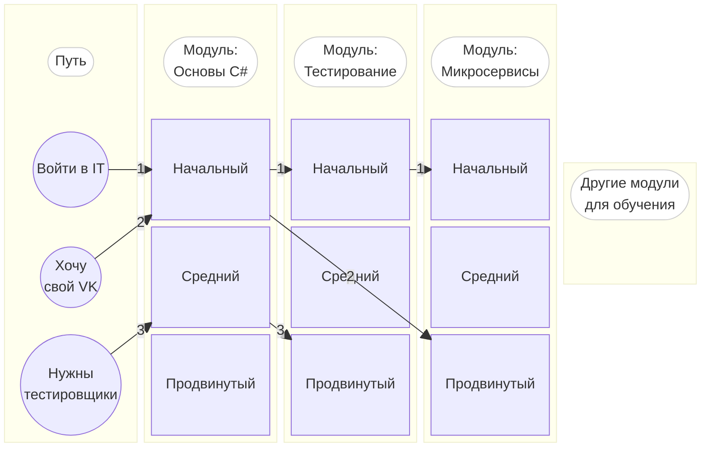

# Структура курса

Авторы курса поставили перед собой амбициозную цель — создать материал, подходящий каждому, не зависимо от уровня его начальных знаний и конечной цели. Со стандартным «книжным» или «лекционным» подходом сделать это сложнее. Необходимо более динамическое решение, учитывающее возможности современных технологий.

Поэтому было решено разметить весь обучающий материал специальными измерениями, помогающими оценить подаваемую информацию с различных сторон. Измерения могут описать произвольные части материала, целый модуль или подмодуль. Далее, зная начальную точку обучения и конечную цель ученика, с учётом выбранных измерений (глубины проработки, технологий, времени обучения и т.д.), мы можем построить персональный путь в графе всех модулей для освоения выбранных специализаций.

## Методологическая структура курса

Методологическая структура курса представляет собой ориентированный ациклический граф. Его вершинами являются модули курса (с набором тем), а рёбрами — дороги, которые необходимо пройти для освоения этих тем. В этом графе отсутствуют направленные циклы. Т.е. для освоения двух любых модулей вам никогда не потребуется обязательное знание из парного модуля. Но могут быть «параллельные» пути, выходящие из одного начального модуля и разными дорогами приходящие в один конечный модуль.

> :basecamp: TODO: Нарисовать граф в виде roadmap, например как у [Nick Chapsas](https://www.youtube.com/watch?v=1oeMTz7LwrU)

Цель прохождения курса определяет путь, который необходимо будет освоить. Путь состоит из модулей и связей между ними. Он помогает вам добраться от начальной точки знаний, до конечной цели, с учётом ваших требований к материалам.

Примеры путей:
- Автоматизированное тестирование
- Консольные приложения
- Микросервисы
- Настольные (desktop) приложения
- Мобильные приложения

Курс может изменяться со временем. Ибо появляются новые материалы, меняются подходы, устаревают технологии. Поэтому курс планируется постоянно обновлять и держать в актуальном состоянии.

Любую тему можно раскрыть тысячами разных статей и лекций. Экспертный комитет отвечает за то, чтобы в курс попадали оптимальные по качеству и понятности материалы. Именно на основании его мнения и формируется содержимое всех модулей.

## Физическая структура курса

Курс состоит из трёх блоков:

1. [Методология](https://github.com/EduWebDotNet/methodology/wiki) — в нём собраны материалы, помогающие осознать принципы работы с курсом. Этот блок нужен для авторов курса.
2. [Теория](https://edudotnet.gitbook.io/edu-dot-net) — набор модулей, состоящих из теоретических материалов.
3. [Практика](https://github.com/EduWebDotNet/hands-on-personal) — программный код, необходимый для закрепления практических навыков.

### Репозиторий с теорией

Весь теоретический материал должен быть размечен измерениями. Они являются основой для построения индивидуальных путей обучения.

Основой репозитория являются модули. Они располагаются в папке `theory`, которая находится в корне репозитория. Каждый модуль представляет собой отдельную папку. Имя модуля [[соответствует упорядоченному идентификатору ресурса|Ori]].

Внутри директории-модуля располагается набор [markdown](https://ru.wikipedia.org/wiki/Markdown) файлов с расширением `md`. Они не предназначены для просмотра материала курса напрямую, но мы стараемся поддерживать их в читабельном формате. Каждый такой файл является подмодулем. Имя подмодуля [[соответствует упорядоченному идентификатору ресурса|Ori]]. Все текстовые файлы должны быть в кодировке UTF-8.

### Репозиторий с практикой

Почти каждому теоретическому модулю соответствует блок с практическими заданиями. Они выделены в отдельный репозиторий для простоты клонирования и изменения в процессе обучения.

К корне репозитория располагается папка `practice`. Она наполнена папками, имена которых соответствуют имени модуля (в формате [[Ori]]) для которого предназначено практическое задание.

#### Метаданные

Для построения индивидуального пути изучения курса, мы используем разметку всего материала с помощью измерений. Измерения бывают двух типов: встраиваемые (inline) и блочные (не встраиваемые). Подробнее о всех поддерживаемых измерениях можно почитать в [[отдельной статье|Dimensions]].

Измерения первого типа могут быть встроены в любую часть текста модуля. Таким образом мы обогащаем содержимое метаинформацией об измерении. Для примера можно посмотреть на [[demoji разметку|Dimoji]].

Блочными измерениями можно разметить только весь подмодуль целиком. Это одна из причин выделения подмодуля из цельного модуля. Блочная метаинформация актуальна только в рамках размеченного подмодуля. Подмодуль, следующий за размеченным, начинает с чистого листа измерений и должен быть размечен заново. Это необходимо для того чтобы иметь возможность менять подмодули местами.

#### Подмодуль

Каждый физический markdown файл в папке модуля является подмодулем. В начале содержимого каждого файла может быть указан блок с метаинформацией (ключ-значение) об этом подмодуле. Этот блок оформляется по [стандарту frontmatter YAML](https://jekyllrb.com/docs/front-matter/).

Разбиение модуля на подмодули необходимо, если какую-то часть учебного материала требуется разметить блочными измерениями. Для подобной разметки следует применять латинские названия измерений и их значения. С соблюдением регистра символов (обычно это PascalCase).

Пример разметки файла подмодуля с помощью frontmatter YAML:

```markdown
---
Subject: DevOps
Tool: Kubernetes
---
Давайте поговорим о **несуществующих** профессиях и их игрушках.
```

#### Модуль

Материал модуля собирается из всех markdown файлов (подмодулей) в папке модуля с учётом метаинформации. Получившийся текст размечен специальными служебными тегами — [[Dimoji|Dimoji]]. С помощью этих тегов мы можем определять измерения для более мелких блоков текста. И, в зависимости от выбранного пути, удалять или оставлять необходимые блоки. Таким образом полный текст модуля урезается под нужды конкретных требований. После обработки dimoji-препроцессором, специальные теги удаляются, а выходной документ остаётся с валидным markdown форматом.

### Пример

Рассмотри для примера 3 модуля, содержащие материал различного уровня сложности.



1. Если мы хотим быстро вникнуть во все темы, то мы можем выбрать путь, включающий в себя все модули и оставить только материал начального уровня.
2. Если мы хотим быстро построить свой большой сайт, то нам не нужно тратить время на всё лишнее, достаточно начальных знаний языка. А вот в микросервисах придётся стать продвинутым профессионалом.
3. Если нам срочно понадобилось обучить армию продвинутых тестировщиков, то им нужно уверенно владеть языком и быть профессионалами в модуле тестирования.

